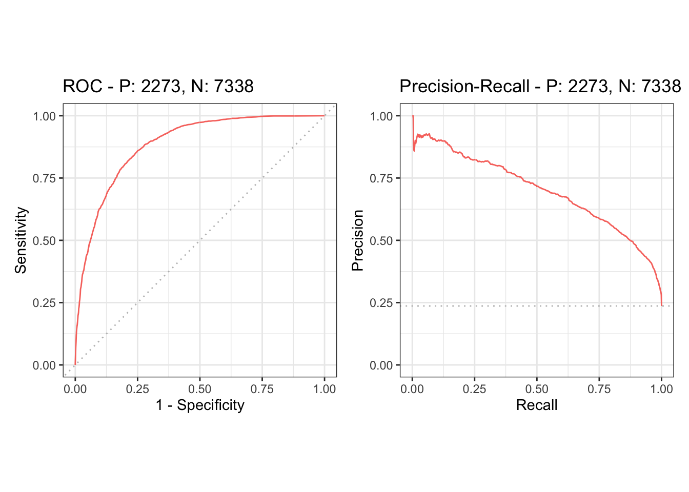

# m6APrediction: m6A Modification Site Prediction in R

<!-- badges: start -->
[](https://lifecycle.r-lib.org/articles/stages.html#experimental)
<!-- badges: end -->

## Overview

The `m6APrediction` package provides a straightforward and efficient tool to predict N6-methyladenosine (m6A) modification sites from various sequence and genomic features. It uses a pre-trained Random Forest model to deliver predictions for both single data points and batch datasets, making it suitable for a wide range of transcriptomic analyses.

The core purpose of this package is to allow researchers to quickly assess the probabilities of m6A modification on RNA sequences based on a set of predictive features.

## Model Performance

The underlying Random Forest model demonstrates strong predictive performance. The Receiver Operating Characteristic (ROC) and Precision-Recall (PRC) curves below show its ability to distinguish between true m6A sites and non-m6A sites.

| ROC Curve and PRC Curve |
|:-------------------------:|
|  |


## Installation

You can install the development version of `m6APrediction` from GitHub with:

```r
# install.packages("devtools")
devtools::install_github("Chenyu12161004/m6APrediction")
```

## Usage Example

Here is a minimal example demonstrating how to use the two main functions of the package: `prediction_single()` and `prediction_multiple()`.

First, load the package:
```{r example-load-package}
devtools::load_all()
```

### Single Prediction

To predict the m6A status for a single site with specific features:

```{r example-single-prediction}
# Load the pre-trained model included with the package
rf_model <- readRDS(
  system.file("extdata", "rf_fit.rds", package = "m6APrediction")
)

# Predict for a single data point
single_pred <- prediction_single(
  ml_fit = rf_model,
  gc_content = 0.5,
  RNA_type = "mRNA",
  RNA_region = "CDS",
  exon_length = 10,
  distance_to_junction = 8,
  evolutionary_conservation = 0.5,
  DNA_5mer = "GGACA"
)

# Print the result
print(single_pred)
```

### Multiple Predictions

To run predictions on a batch of sites from a data frame:

```{r example-multiple-prediction}
# Load the example data frame included with the package
example_df <- read.csv(
  system.file("extdata", "m6A_input_example.csv", package = "m6APrediction")
)

# Run batch prediction
# Note: We are using the rf_model loaded in the previous step
multi_pred <- prediction_multiple(
  ml_fit = rf_model,
  feature_df = example_df,
  positive_threshold = 0.6
)

# Display the first few rows of the results
head(multi_pred)
```
